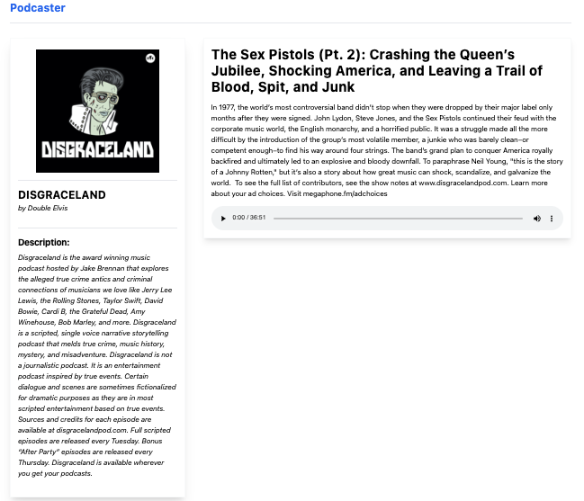

# Frontend test. Podcaster app.

This project is a technical test for the Frontend Developer position.
A mini-application has been created to listen to music podcas

The application has three views:
- The main view, where the podcasts are displayed.
- The podcast detail view, where the episodes of a podcast are shown.
- The episode detail view, where the audio player is displayed.

The application is a SPA (Single Page Application) and it has been created with [Vite](https://vitejs.dev/) and its plugin for React. Vite was chosen because it is a very fast and lightweight bundler, and it has a development server with hot reloading that allows for a comfortable development experience.

## Installation and Application Modes

To install the dependencies, execute `npm install`.

The application has two modes:
- Development mode: `npm run dev`
- Production mode: `npm run build`

Depending on the mode in which it is executed, the application will behave differently. In development mode, assets are not minified or concatenated, while in production mode they are.

## Tests
### Unit tests
To run the unit tests, execute `npm run test`. A total of 49 tests are executed across 18 suites.
### End-to-End tests
To run the end-to-end tests, execute `npm run cypress`. A total of 2 tests are executed.

## Considered Restrictions
- URLs are clean, so the hash `\#` has not been used for navigation.
- Neither AngularJS nor Ember have been used.
- No mobile mode has been implemented.
- Error handling has been done in a very basic way, specific errors are not shown to the user, and they are displayed in the browser console.

## Used Technologies
- React
- React Router Dom
- React Testing Library
- Cypress
- Zustand
- Axios
- TypeScript
- Tailwind CSS
- Vite
- ESLint
- Prettier
- Jest
- React-html-parser
- date-fns


## Solution Approach
- A SPA application has been created using React and React Router Dom.
- Tailwind CSS has been used for styling.
- Zustand has been used for state management.
- Axios has been used for HTTP requests.
- Cypress has been used for E2E tests.
- React Testing Library and Jest have been used for unit tests.
- React-html-parser has been used for parsing episode HTML.
- date-fns has been used for date formatting.
- ESLint and Prettier have been used for code linting and formatting.
- Vite has been used as the bundler.
- TypeScript has been used as the programming language.
- All the constants of the application can be found in the `src/infrastructure/constants/constants.ts` file. By doing this, if a constant needs to be changed, it only needs to be updated in that file, avoiding the usage of magic numbers or strings. In the future, if those data are obtained from an API, they could be fetched from there, eliminating the need to modify the code.
- Custom hooks have been created for data management in the application. All the application logic resides in these hooks, making the components logic-free and responsible for rendering data only.

## Folder Structure
```
.
├── cypress
├── public
└── src
    ├── Pages
    ├── components
    ├── hooks
    └── infrastructure
        ├── constants
        ├── helpers
        ├── services
        ├── stores
        ├── types
        └── utils
```
There are some components like EpisodeGrid that have child components saved in a components folder within the parent component's folder (`GridHeader, EpisodeRow`). This way, the need to create a component in the folder tree for each grid element is avoided.


## Routes and Views
Routes are stored in an object in the `src/infrastructure/constants/routes.ts` file. This way, if a route needs to be changed, it only needs to be updated in that file. Similarly, if the application grows and more routes are added, they need to be added to that file. The routes are:
- `/`: Main view.
- `/podcast/:podcastId`: Podcast detail view.
- `/podcast/:podcastId/chapter/:chapterId`: Episode detail view.

On all views, While the data is being loaded, a spinner is shown on the right side of the header. 
While dinamic data is being loaded, a loader component is shown. 


### Main View

In this view, the top 100 most popular podcasts from iTunes are displayed. They are shown in the form of cards, and each card includes an image, the podcast title, and the author. Clicking on a card navigates to the detail view of that podcast.
- The result of the API call is stored in localStorage, so if the page is refreshed, the data saved in localStorage is displayed until 24 hours have passed since the last API call.
- The user can search for podcasts by title or author. The search is displayed instantly, so there is no need to press any button to perform the search.
- While the data is being loaded, the search input is disabled.
- The page title is "Podcaster". It is disabled in this view, but it is enabled and allows navigation to the main view in the other two views.

### Podcast Detail View

- The route for this view is `/podcast/:podcastId`, where `:podcastId` is the podcast id.
- If the podcast detail is not in localStorage, an API call is made to retrieve it. If it is in localStorage, it is retrieved from there unless 24 hours have passed since the last API call, in which case an API call is made to retrieve it.
- While the data is being loaded, a spinner is shown on the right side of the header.
- The call is made through the [Allow Origin](https://alloworigin.com/) service, as the iTunes API does not allow requests from the browser.
- A sidebar is shown with the podcast image, title, author, and description.
- A section is shown in a list format with the podcast episodes. Each episode has a title, publication date, and duration. Clicking on an episode navigates to the detail view of that episode.

### Episode Detail View

- The route for this view is `/podcast/:podcastId/chapter/:chapterId`, where `:podcastId` is the podcast id and `:chapterId` is the episode id.
- The sidebar from the podcast detail view is reused. However, in this case, clicking on the podcast title or image navigates to the detail view of that podcast.
- A section is shown with the episode title, description, and a player (using the HTML5 native player).
- If the episode description contains HTML, it is parsed using React-html-parser (displayed as interpreted).

